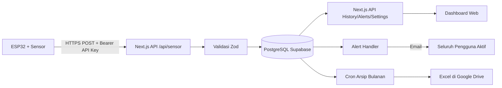

# Product Requirements Document (PRD)

## Server Room Monitoring System

| Atribut | Nilai |
|---|---|
| Nama produk | Server Room Monitoring System |
| Versi dokumen | 3.0 |
| Status | Aktif dikembangkan |
| Platform | Web responsif / desktop browser |
| Bahasa antarmuka | Indonesia |
| Zona waktu utama | WIB (`Asia/Jakarta`) |
| Repository | `elsaaa25/server-room-monitoring` |
| Lingkungan produksi | Vercel |
| Database | PostgreSQL Supabase |
| Terakhir diperbarui | 24 Agustus 2026 |

---

## 1. Ringkasan Produk

Server Room Monitoring System adalah aplikasi web untuk memantau kondisi ruang server secara hampir real-time. Sistem menerima pembacaan sensor dari ESP32 melalui API HTTPS, menyimpan data ke PostgreSQL Supabase, menampilkan kondisi terkini pada dashboard, menyediakan grafik dan riwayat, serta membuat peringatan ketika suhu atau tegangan melewati batas yang telah ditentukan.

Sistem mendukung **dua lokasi sensor**:
- **TEMP-L4** — Lantai 4 (Ruang Server): sensor suhu, tegangan, dan arus.
- **TEMP-L5** — Lantai 5 (Ruang ATC): sensor suhu.

Produk ini tidak mengendalikan AC atau aktuator. Fungsi utamanya adalah monitoring, pencatatan, visualisasi, peringatan, notifikasi email, dan pengarsipan data.

---

## 2. Latar Belakang Masalah

Ruang server membutuhkan kondisi suhu dan tegangan yang stabil. Pemantauan manual memiliki beberapa keterbatasan:

- kondisi ruangan tidak selalu diperiksa setiap saat;
- kenaikan suhu atau anomali tegangan dapat terlambat diketahui;
- tidak tersedia riwayat yang rapi untuk analisis;
- status sensor sulit diketahui ketika perangkat terputus;
- laporan bulanan membutuhkan proses manual.

Sistem ini dibuat untuk menyediakan satu pusat monitoring yang mudah diakses melalui komputer, menampilkan informasi penting secara cepat, mengirimkan notifikasi otomatis via email, dan menyimpan rekam data yang dapat ditinjau kembali.

---

## 3. Tujuan Produk

### 3.1 Tujuan Utama

1. Menampilkan kondisi suhu Lantai 4 dan Lantai 5 secara hampir real-time.
2. Menampilkan kondisi tegangan dan arus Lantai 4 secara hampir real-time.
3. Memberikan peringatan dan notifikasi email saat suhu atau tegangan melewati batas.
4. Menyediakan grafik perubahan suhu dan tegangan yang mudah dibaca.
5. Menyediakan riwayat pembacaan sensor dalam zona waktu WIB.
6. Menampilkan status sensor online atau offline.
7. Menyediakan pengaturan batas suhu dan tegangan yang hanya dapat diubah administrator.
8. Mengarsipkan data bulanan ke Google Drive dalam format Excel.

### 3.2 Sasaran Keberhasilan

- Data terbaru tampil tanpa reload halaman.
- Grafik responsif pada riwayat besar.
- Peringatan tidak dibuat berulang untuk satu siklus kondisi yang sama.
- Email notifikasi terkirim ke seluruh pengguna aktif saat peringatan baru terjadi.
- Administrator dapat memahami kondisi kedua ruangan dalam waktu kurang dari satu menit.

---

## 4. Ruang Lingkup

### 4.1 Termasuk dalam Produk (Sudah Berjalan)

- autentikasi pengguna (login email + password, JWT 8 jam);
- role `ADMIN` (satu-satunya role aktif);
- monitoring suhu Lantai 4 (`TEMP-L4`);
- monitoring suhu Lantai 5 (`TEMP-L5`);
- monitoring tegangan Lantai 4 (sensor ZMPT101B);
- monitoring arus Lantai 4 (sensor ACS712);
- alert suhu: Waspada dan Bahaya, dengan eskalasi;
- alert tegangan: Drop dan Surge, dengan level Waspada/Bahaya;
- notifikasi email ke semua pengguna aktif saat peringatan dibuat;
- dashboard ringkasan kedua lantai;
- grafik suhu dan tegangan dengan periode 1 jam, 6 jam, 24 jam;
- halaman grafik dengan periode hingga 7 hari;
- halaman riwayat sensor;
- halaman peringatan dengan fungsi tandai ditangani;
- halaman pengaturan (hanya admin);
- batas suhu L4 dan L5 yang dapat dikonfigurasi secara terpisah;
- batas tegangan min/max yang dapat dikonfigurasi;
- status sensor online/offline;
- ekspor CSV dari halaman grafik;
- arsip Excel bulanan ke Google Drive;
- deployment aplikasi melalui Vercel;
- tampilan responsif untuk desktop, tablet, dan mobile;
- dark mode / light mode toggle.

### 4.2 Dalam Pengembangan / Direncanakan

- pencatatan data berbasis perubahan suhu (change-based monitoring);
- heartbeat perangkat terpisah dari data historis;
- optimasi polling grafik (hanya ambil data terbaru, bukan seluruh riwayat);
- ekspor bulanan menggunakan data asli database;
- finalisasi penghapusan aman setelah arsip diverifikasi.

### 4.3 Tidak Termasuk

- kontrol otomatis AC, kipas, atau aktuator;
- aplikasi Android/iOS native;
- prediksi suhu dengan machine learning;
- multi-tenant atau banyak instalasi;
- notifikasi WhatsApp, Telegram, atau SMS;
- monitoring kamera/CCTV;
- kontrol kelistrikan jarak jauh.

---

## 5. Pengguna

Sistem hanya memiliki satu tipe pengguna aktif: **Administrator**.

### Administrator

Administrator bertugas memantau kondisi ruangan, menindaklanjuti peringatan, dan mengonfigurasi sistem.

Hak akses:

- login ke aplikasi;
- melihat dan berinteraksi dengan semua halaman (dashboard, grafik, riwayat, peringatan, pengaturan);
- mengubah batas suhu, batas tegangan, interval polling, dan batas offline sensor;
- menandai peringatan sebagai ditangani;
- mengekspor data CSV.

> **Catatan implementasi:** Schema database mendefinisikan kolom `role` dengan nilai `OPERATOR` atau `ADMIN`, namun `auth.ts` saat ini mengembalikan semua pengguna sebagai `ADMIN`. Role `OPERATOR` belum aktif digunakan.

---

## 6. Alur Sistem Utama



### 6.1 Alur Pembacaan Sensor

1. ESP32 membaca nilai suhu, tegangan, dan/atau arus.
2. ESP32 mengirim payload JSON ke `POST /api/sensor` dengan Bearer API Key.
3. API memvalidasi identitas perangkat dan format payload menggunakan Zod.
4. Data valid disimpan ke tabel `sensor_readings`.
5. Sistem mengevaluasi batas suhu (L4 dan L5 dengan threshold terpisah).
6. Sistem mengevaluasi batas tegangan (Drop/Surge, khusus TEMP-L4).
7. Alert dibuka, dieskalasi, atau diselesaikan sesuai kondisi.
8. Jika alert baru dibuat, email notifikasi dikirim ke semua pengguna aktif.
9. Dashboard mengambil data terbaru melalui polling dan memperbarui tampilan.

---

## 7. Kebutuhan Fungsional

### FR-001 — Autentikasi

- Pengguna login menggunakan email dan password.
- Password disimpan dalam bentuk hash (bcryptjs).
- Sesi menggunakan JWT dengan durasi 8 jam.
- Pengguna harus memverifikasi email sebelum dapat login (`email_verified_at`).
- Pengguna dengan `must_change_password = true` diarahkan ke halaman ganti password pertama.
- Pengguna tidak aktif (`is_active = false`) tidak dapat login.
- Pengguna yang belum login diarahkan ke `/login`.

Halaman autentikasi yang tersedia:
- `/login` — halaman masuk
- `/verifikasi-email` — verifikasi email
- `/konfirmasi-password` — konfirmasi password
- `/ganti-password-pertama` — ganti password pertama setelah akun dibuat

### FR-002 — Otorisasi

- Semua halaman selain publik memerlukan sesi aktif.
- Endpoint perubahan pengaturan (`POST /api/settings`) memeriksa `session.user.role === "ADMIN"`.
- Pembatasan di server tidak boleh hanya bergantung pada pembatasan UI.

### FR-003 — Penerimaan Data Sensor

Endpoint:

```text
POST /api/sensor
Authorization: Bearer <SENSOR_API_KEY>
Content-Type: application/json
```

Sensor yang diterima:

| `sensorId` | Lokasi |
|---|---|
| `TEMP-L4` | Lantai 4 (Ruang Server) |
| `TEMP-L5` | Lantai 5 (Ruang ATC) |

Skema payload (validasi Zod):

```json
{
  "sensorId": "TEMP-L4",
  "temperature": 23.6,
  "voltage": 220.4,
  "current": 1.35
}
```

| Field | Tipe | Wajib | Rentang |
|---|---|---|---|
| `sensorId` | string | Ya | `TEMP-L4` atau `TEMP-L5` |
| `temperature` | number | Ya | -40°C hingga 100°C |
| `voltage` | number | Tidak | 0 hingga 300 V |
| `current` | number | Tidak | 0 hingga 999 A |

Ketentuan respons:

- request tidak sah → `401`
- payload tidak valid → `400`
- data berhasil disimpan → `201` dengan `{ success: true, readingId }`

### FR-004 — Klasifikasi Suhu

Klasifikasi menggunakan batas dari `monitoring_settings`. Batas L4 dan L5 dikonfigurasi secara terpisah.

| Status | Kondisi |
|---|---|
| Normal | Suhu < batas waspada |
| Waspada | Suhu ≥ batas waspada dan < batas bahaya |
| Bahaya | Suhu ≥ batas bahaya |

Nilai awal bawaan:

| Parameter | Nilai |
|---|---|
| `warning_temperature` (L4) | 27°C |
| `danger_temperature` (L4) | 30°C |
| `warning_temperature_l5` (L5) | 27°C |
| `danger_temperature_l5` (L5) | 30°C |

### FR-005 — Klasifikasi Tegangan

Klasifikasi menggunakan batas dari `monitoring_settings`.

| Anomali | Kondisi |
|---|---|
| Normal | voltageMin ≤ tegangan ≤ voltageMax |
| Drop | Tegangan < voltageMin |
| Surge | Tegangan > voltageMax |

Level alert dihitung berdasarkan deviasi dari batas:
- deviasi ≤ 10% → Waspada
- deviasi > 10% → Bahaya

Nilai awal bawaan:

| Parameter | Nilai |
|---|---|
| `voltage_min` | 200 V |
| `voltage_max` | 240 V |

Monitoring tegangan hanya berlaku untuk sensor `TEMP-L4`.

### FR-006 — Sistem Peringatan Suhu

- Peringatan dibuat ketika suhu masuk level Waspada atau Bahaya.
- Hanya boleh ada satu peringatan aktif per sensor (unique index di database).
- Perubahan dari Waspada ke Bahaya dianggap eskalasi: alert yang ada diperbarui.
- Ketika suhu kembali normal, alert aktif diselesaikan (`status = 'Ditangani'`, `resolved_at = NOW()`).
- Data yang tersimpan: `reading_id`, `sensor_id`, `level`, `status`, `temperature`, `title`, `detail`, `created_at`, `acknowledged_at`, `resolved_at`, `handled_by`.
- `reading_id` bersifat `ON DELETE SET NULL` agar arsip riwayat tidak menghapus catatan peringatan.

### FR-007 — Sistem Peringatan Tegangan

- Peringatan dibuat ketika tegangan masuk kondisi Drop atau Surge.
- Hanya boleh ada satu peringatan tegangan aktif per sensor.
- Ketika tegangan kembali normal, alert aktif diselesaikan.
- Data yang tersimpan: `reading_id`, `sensor_id`, `anomaly_type`, `level`, `status`, `voltage`, `title`, `detail`, `created_at`, `acknowledged_at`, `resolved_at`, `handled_by`.

### FR-008 — Notifikasi Email

- Setiap kali peringatan suhu atau tegangan baru dibuat (atau dieskalasi), sistem mengirim email otomatis.
- Penerima email adalah seluruh pengguna dengan `is_active = TRUE`.
- Email berisi judul peringatan, detail kondisi, dan tautan ke dashboard peringatan.
- Pengiriman email dilakukan secara async agar tidak memblokir respons ke ESP32.

### FR-009 — Dashboard Utama

Dashboard menampilkan:

- suhu terbaru Lantai 4 dan Lantai 5;
- tegangan terbaru Lantai 4;
- arus terbaru Lantai 4 (jika tersedia);
- status sensor (online/offline) setiap lantai;
- kondisi suhu (Normal/Waspada/Bahaya);
- kondisi tegangan (Normal/Drop/Surge);
- waktu pembaruan terakhir (WIB);
- grafik suhu per lantai;
- grafik tegangan;
- batas Normal/Waspada/Bahaya pada grafik;
- suhu tertinggi, terendah, dan rata-rata;
- lima pembacaan terbaru;
- tautan ke riwayat dan peringatan.

### FR-010 — Grafik Dashboard

- Pilihan periode: 1 jam, 6 jam, 24 jam.
- Grafik suhu L4 dan L5 ditampilkan terpisah.
- Grafik tegangan menggunakan skala Y terpisah.
- Batas suhu pada grafik mengikuti pengaturan database.
- Polling dashboard tidak boleh memuat ulang seluruh riwayat pada setiap interval.
- Riwayat penuh dimuat saat halaman, lantai, atau periode berubah.
- Jumlah titik yang dirender dibatasi (maksimal sekitar 300 titik).
- Animasi Recharts dinonaktifkan untuk pembaruan realtime berulang.
- Jika hanya ada satu titik data, grafik menampilkan dot agar data terlihat.
- Semua label waktu menggunakan WIB.

### FR-011 — Halaman Grafik

Halaman grafik menyediakan:

- periode 1 jam, 6 jam, 24 jam, dan 7 hari;
- kartu nilai terakhir dan rata-rata;
- grafik suhu L4 dan L5 secara terpisah;
- grafik tegangan dan arus;
- tombol pembaruan manual;
- informasi waktu pembaruan terakhir;
- export CSV (kolom suhu L4, suhu L5, tegangan, arus, waktu WIB);
- state loading, kosong, dan error.

### FR-012 — Riwayat Sensor

Endpoint:

```text
GET /api/sensor/history
```

Filter yang didukung: `sensorId`, `hours`, `date`, `limit`.

Ketentuan:

- hanya pengguna login yang dapat mengakses;
- urutan default terbaru ke terlama;
- filter tanggal menggunakan WIB;
- respons berisi `id`, `sensorId`, `temperature`, `voltage`, `current`, `recordedAt`;
- jumlah data dibatasi untuk mencegah query berlebihan.

### FR-013 — Halaman Peringatan

- Menampilkan daftar peringatan suhu dari `temperature_alerts`.
- Filter tersedia: status (`Aktif`/`Ditangani`), level (`Waspada`/`Bahaya`).
- Pengguna dapat menandai satu atau semua peringatan aktif sebagai "Ditangani" (`PATCH /api/alerts`).
- `handled_by` diisi dengan ID pengguna yang menangani.

### FR-014 — Status Sensor Online/Offline

- Sensor dinyatakan online bila data terakhir diterima dalam batas `offline_timeout` detik.
- Sensor dinyatakan offline bila melewati batas tersebut.
- Batas `offline_timeout` dapat dikonfigurasi melalui pengaturan (default: 30 detik).

### FR-015 — Pengaturan Monitoring

Pengaturan global disimpan dalam satu record `id = 'global'` di tabel `monitoring_settings`.

Parameter yang dapat diubah oleh administrator:

| Parameter | Keterangan | Default |
|---|---|---|
| `warning_temperature` | Batas waspada L4 (°C) | 27 |
| `danger_temperature` | Batas bahaya L4 (°C) | 30 |
| `warning_temperature_l5` | Batas waspada L5 (°C) | 27 |
| `danger_temperature_l5` | Batas bahaya L5 (°C) | 30 |
| `voltage_min` | Batas minimum tegangan (V) | 200 |
| `voltage_max` | Batas maksimum tegangan (V) | 240 |
| `refresh_interval` | Interval polling UI (detik) | 4 |
| `offline_timeout` | Batas offline sensor (detik) | 30 |
| `sensor_name` | Nama sensor | Sensor Ruang Server |
| `sensor_id` | ID sensor | esp32-01 |
| `browser_notification` | Notifikasi browser | true |
| `sound_alert` | Suara peringatan | false |

Aturan validasi:

- `danger_temperature` harus lebih tinggi dari `warning_temperature`;
- `voltage_max` harus lebih tinggi dari `voltage_min`;
- hanya administrator yang dapat menyimpan perubahan.

### FR-016 — Arsip Excel Bulanan

Sistem membuat satu file `.xlsx` untuk setiap bulan kalender.

Nama file:

```text
monitoring-ruang-server-YYYY-MM.xlsx
```

Sheet wajib:

1. `Data Sensor` — seluruh baris pembacaan bulan tersebut
2. `Ringkasan Harian` — min, max, rata-rata per hari per parameter

Format kolom `Data Sensor`:

| No. | Tanggal dan Waktu WIB | Suhu Lantai 4 (°C) | Suhu Lantai 5 (°C) | Tegangan (V) | Arus (A) |
|---:|---|---:|---:|---:|---:|

Ketentuan:

- file diunggah ke folder Google Drive yang dikonfigurasi via OAuth 2.0;
- status ekspor dicatat di `monthly_export_logs`;
- file tidak dianggap selesai sebelum jumlah baris diverifikasi.

### FR-017 — Finalisasi Arsip dan Penghapusan Aman

- Data hanya dihapus setelah upload Google Drive berhasil.
- Jumlah baris yang diekspor harus sama dengan yang akan dihapus.
- Penghapusan hanya mencakup bulan arsip tertentu (bukan `TRUNCATE`).
- Fungsi database `finalize_monthly_sensor_archive(date)` mengelola proses ini.
- Peringatan tetap dipertahankan walaupun `reading_id` menjadi null.
- Kegagalan proses mengubah status log menjadi gagal tanpa menghapus data.

### FR-018 — Zona Waktu

- Seluruh tampilan pengguna menggunakan WIB.
- Zona waktu canonical: `Asia/Jakarta`.
- Timestamp database menggunakan `TIMESTAMPTZ`.
- Filter tanggal menghitung batas hari berdasarkan WIB.
- File CSV dan Excel menggunakan label waktu WIB.

---

## 8. Halaman dan Navigasi

| Halaman | Route | Akses | Fungsi utama |
|---|---|---|---|
| Login | `/login` | Publik | Autentikasi pengguna |
| Verifikasi Email | `/verifikasi-email` | Publik | Verifikasi email baru |
| Konfirmasi Password | `/konfirmasi-password` | Publik | Konfirmasi password baru |
| Ganti Password Pertama | `/ganti-password-pertama` | Login | Ganti password awal |
| Dashboard | `/` | Login | Ringkasan kondisi dan grafik utama |
| Grafik | `/grafik` | Login | Analisis grafik periode panjang |
| Riwayat | `/riwayat` | Login | Tabel historis dan filter |
| Peringatan | `/peringatan` | Login | Daftar dan penanganan alarm |
| Pengaturan | `/pengaturan` | Admin | Konfigurasi sistem |
| Profil | `/profil` | Login | Profil pengguna |

Navigasi menggunakan sidebar pada desktop dan drawer pada mobile.

---

## 9. Spesifikasi UI/UX

### 9.1 Prinsip Tampilan

- antarmuka bersih dan profesional;
- informasi kritis terlihat tanpa banyak langkah;
- desain responsif (desktop, tablet, mobile);
- dark mode dan light mode tersedia;
- kartu dengan border tipis, sudut membulat, dan bayangan ringan;
- komponen Shadcn UI, ikon Lucide React, grafik Recharts.

### 9.2 Warna Status

| Status | Warna utama |
|---|---|
| Normal | Hijau |
| Waspada | Amber/oranye |
| Bahaya | Merah/rose |
| Tidak tersedia / Offline | Abu-abu |
| Informasi | Biru |

Status tidak boleh disampaikan hanya melalui warna — selalu gunakan teks dan/atau ikon.

### 9.3 State Wajib Komponen

Setiap komponen data harus menangani:

- loading;
- data tersedia;
- data kosong;
- error;
- sensor offline;
- sensor belum tersedia.

---

## 10. Arsitektur Teknis

### 10.1 Stack

| Area | Teknologi |
|---|---|
| Framework | Next.js 16 App Router |
| Bahasa | TypeScript |
| UI | React, Shadcn UI, Tailwind CSS |
| Grafik | Recharts |
| Validasi | Zod |
| Autentikasi | Auth.js (NextAuth) v5 Credentials |
| Password hashing | bcryptjs |
| Database | PostgreSQL Supabase |
| Driver database | `pg` |
| Hosting | Vercel |
| Excel | ExcelJS |
| Google Drive | Google APIs SDK |
| Email | Resend (via `sendEmail`) |

### 10.2 Komponen Utama

```text
ESP32
  └── HTTPS POST /api/sensor
        ├── validasi Bearer API key
        ├── validasi Zod (sensorId, temperature, voltage, current)
        ├── INSERT sensor_readings
        ├── evaluasi temperature_alerts (L4 dan L5 dengan threshold terpisah)
        ├── evaluasi voltage_alerts (hanya TEMP-L4)
        └── kirim email ke semua pengguna aktif (async)

Browser
  ├── Auth.js session (JWT)
  ├── GET /api/settings
  ├── GET /api/sensor/history
  ├── GET /api/alerts
  ├── PATCH /api/alerts (tandai ditangani)
  └── polling data terbaru setiap N detik

Cron arsip
  ├── query data bulan sebelumnya
  ├── buat workbook Excel (Data Sensor + Ringkasan Harian)
  ├── upload ke Google Drive via OAuth
  ├── verifikasi jumlah baris
  └── finalisasi dan penghapusan aman
```

### 10.3 Strategi Realtime

Versi saat ini menggunakan polling HTTP karena sederhana dan kompatibel dengan Vercel serverless.

Strategi performa:

- riwayat penuh dimuat hanya saat konteks berubah (halaman/lantai/periode);
- polling hanya mengambil data terbaru;
- permintaan yang sedang berjalan tidak ditumpuk (abort sebelum request baru);
- grafik dirender dengan jumlah titik terbatas (≈300 titik);
- animasi Recharts dinonaktifkan untuk pembaruan berulang.

WebSocket atau Server-Sent Events dapat dipertimbangkan jika kebutuhan realtime meningkat.

---

## 11. Model Data

### 11.1 `users`

| Kolom | Tipe | Keterangan |
|---|---|---|
| `id` | UUID | Primary key |
| `name` | VARCHAR(100) | Nama pengguna |
| `email` | VARCHAR(255) | Email unik |
| `password_hash` | TEXT | Hash password |
| `role` | VARCHAR(20) | `OPERATOR` atau `ADMIN` |
| `is_active` | BOOLEAN | Status akun |
| `email_verified_at` | TIMESTAMPTZ | Waktu verifikasi email |
| `must_change_password` | BOOLEAN | Wajib ganti password pertama |
| `session_version` | INTEGER | Versi sesi untuk invalidasi |
| `created_at` | TIMESTAMPTZ | Waktu dibuat |
| `updated_at` | TIMESTAMPTZ | Waktu diperbarui |

### 11.2 `sensor_readings`

| Kolom | Tipe | Keterangan |
|---|---|---|
| `id` | SERIAL | Primary key |
| `sensor_id` | VARCHAR(50) | `TEMP-L4` atau `TEMP-L5` |
| `temperature` | NUMERIC(4,2) | Suhu dalam °C |
| `voltage` | NUMERIC(5,2) | Tegangan (nullable, hanya L4) |
| `current` | NUMERIC(6,3) | Arus (nullable, hanya L4) |
| `recorded_at` | TIMESTAMPTZ | Waktu perekaman |

Indeks utama:

```sql
(sensor_id, recorded_at DESC)
```

### 11.3 `temperature_alerts`

| Kolom | Tipe | Keterangan |
|---|---|---|
| `id` | SERIAL | Primary key |
| `reading_id` | INTEGER | Referensi pembacaan, nullable saat arsip |
| `sensor_id` | VARCHAR(50) | Identitas sensor |
| `level` | VARCHAR(20) | `Waspada` atau `Bahaya` |
| `status` | VARCHAR(20) | `Aktif` atau `Ditangani` |
| `temperature` | NUMERIC(4,2) | Nilai saat peringatan dibuat |
| `title` | VARCHAR(150) | Judul peringatan |
| `detail` | TEXT | Detail kondisi |
| `created_at` | TIMESTAMPTZ | Waktu dibuat |
| `acknowledged_at` | TIMESTAMPTZ | Waktu diakui |
| `resolved_at` | TIMESTAMPTZ | Waktu siklus selesai |
| `handled_by` | UUID | Pengguna yang menangani |

Constraint: hanya boleh ada **satu peringatan aktif per sensor** (unique partial index).

### 11.4 `voltage_alerts`

| Kolom | Tipe | Keterangan |
|---|---|---|
| `id` | SERIAL | Primary key |
| `reading_id` | INTEGER | Referensi pembacaan, nullable saat arsip |
| `sensor_id` | VARCHAR(50) | Identitas sensor |
| `anomaly_type` | VARCHAR(10) | `Drop` atau `Surge` |
| `level` | VARCHAR(20) | `Waspada` atau `Bahaya` |
| `status` | VARCHAR(20) | `Aktif` atau `Ditangani` |
| `voltage` | NUMERIC(6,2) | Nilai tegangan saat peringatan |
| `title` | VARCHAR(150) | Judul peringatan |
| `detail` | TEXT | Detail kondisi |
| `created_at` | TIMESTAMPTZ | Waktu dibuat |
| `acknowledged_at` | TIMESTAMPTZ | Waktu diakui |
| `resolved_at` | TIMESTAMPTZ | Waktu siklus selesai |
| `handled_by` | UUID | Pengguna yang menangani |

Constraint: hanya boleh ada **satu peringatan tegangan aktif per sensor**.

### 11.5 `monitoring_settings`

| Kolom | Tipe | Keterangan |
|---|---|---|
| `id` | VARCHAR(20) | `'global'` (satu record) |
| `warning_temperature` | NUMERIC(4,2) | Batas waspada L4 |
| `danger_temperature` | NUMERIC(4,2) | Batas bahaya L4 |
| `warning_temperature_l5` | NUMERIC(4,2) | Batas waspada L5 |
| `danger_temperature_l5` | NUMERIC(4,2) | Batas bahaya L5 |
| `voltage_min` | NUMERIC(5,2) | Batas minimum tegangan |
| `voltage_max` | NUMERIC(5,2) | Batas maksimum tegangan |
| `refresh_interval` | INT | Interval polling UI (detik) |
| `offline_timeout` | INT | Batas offline sensor (detik) |
| `sensor_name` | VARCHAR(100) | Nama sensor |
| `sensor_id` | VARCHAR(50) | ID sensor |
| `browser_notification` | BOOLEAN | Toggle notifikasi browser |
| `sound_alert` | BOOLEAN | Toggle suara peringatan |
| `updated_at` | TIMESTAMPTZ | Waktu perubahan |

### 11.6 `monthly_export_logs`

Tabel ini mencatat proses arsip bulanan.

Kolom minimal:

- bulan arsip;
- status proses (`PROCESSING` → `UPLOADED` → `COMPLETED` atau `FAILED`);
- jumlah data sumber;
- jumlah data yang diekspor;
- ID file Google Drive;
- URL file;
- pesan error;
- waktu mulai dan selesai.

---

## 12. API dan Kontrak

### 12.1 Sensor

| Method | Endpoint | Akses | Fungsi |
|---|---|---|---|
| POST | `/api/sensor` | Bearer API key | Menyimpan pembacaan sensor |
| GET | `/api/sensor/history` | Login | Mengambil riwayat sensor |

### 12.2 Peringatan

| Method | Endpoint | Akses | Fungsi |
|---|---|---|---|
| GET | `/api/alerts` | Login | Mengambil daftar peringatan suhu |
| PATCH | `/api/alerts` | Login | Menandai peringatan sebagai ditangani |

Parameter GET: `limit`, `status`, `level`.

### 12.3 Pengaturan

| Method | Endpoint | Akses | Fungsi |
|---|---|---|---|
| GET | `/api/settings` | Login | Membaca pengaturan global |
| POST | `/api/settings` | Admin | Mengubah pengaturan global |

### 12.4 Autentikasi

Auth.js menangani route autentikasi di:

```text
/api/auth/[...nextauth]
```

API akun tambahan:

```text
/api/account/verify-email
/api/account/confirm-password
/api/account/change-first-password
```

### 12.5 Google Drive dan Arsip

Route yang digunakan:

```text
GET  /api/google/oauth-start
GET  /api/google/oauth-callback
POST /api/cron/monthly-export
```

Route test/konfigurasi hanya diaktifkan di development.

### 12.6 Format Error

Format respons error yang konsisten:

```json
{
  "success": false,
  "error": "Pesan singkat",
  "details": "Detail aman untuk debugging"
}
```

Stack trace, credential, dan connection string tidak boleh dikirim ke browser.

---

## 13. Keamanan

- Seluruh rahasia disimpan dalam environment variable, tidak di repository.
- `SENSOR_API_KEY` digunakan untuk autentikasi ESP32 via Bearer token.
- Password pengguna disimpan dengan hash bcrypt.
- Query database menggunakan parameterized query untuk mencegah SQL injection.
- Koneksi database menggunakan SSL.
- Refresh token Google tidak ditampilkan pada respons client.
- `CRON_SECRET` melindungi endpoint cron dari akses luar.
- Log produksi tidak mencetak password atau rahasia apapun.
- Route pengujian integrasi tidak aktif di produksi.

Environment variable utama:

```text
DB_HOST, DB_PORT, DB_NAME, DB_USER, DB_PASSWORD
AUTH_SECRET
SENSOR_API_KEY
GOOGLE_CLIENT_ID, GOOGLE_CLIENT_SECRET
GOOGLE_REDIRECT_URI, GOOGLE_REFRESH_TOKEN, GOOGLE_DRIVE_FOLDER_ID
CRON_SECRET
APP_URL
RESEND_API_KEY (atau konfigurasi email yang digunakan)
```

---

## 14. Kebutuhan Nonfungsional

### NFR-001 — Performa

- Dashboard awal tampil dalam waktu kurang dari 3 detik pada koneksi normal.
- API pembacaan terbaru merespons kurang dari 500 ms pada beban normal.
- Grafik tidak merender lebih dari 300–360 titik sekaligus.
- Query riwayat menggunakan indeks `(sensor_id, recorded_at DESC)`.
- Polling tidak mengambil ribuan baris secara berulang.

### NFR-002 — Reliabilitas

- Kegagalan satu payload tidak menghentikan sistem.
- Transaksi pembacaan dan peringatan rollback jika terjadi error.
- Data terakhir tetap ditampilkan ketika polling terbaru gagal.
- Permintaan polling tidak ditumpuk jika request sebelumnya belum selesai.
- Proses arsip yang gagal tidak menghapus data sumber.

### NFR-003 — Skalabilitas

- Desain mendukung lebih dari satu sensor (sudah ada L4 dan L5).
- Query selalu menggunakan filter `sensor_id`.
- Tabel memiliki indeks yang sesuai.

### NFR-004 — Aksesibilitas

- Tombol memiliki label yang jelas.
- Status tidak bergantung pada warna saja.
- Navigasi dapat digunakan melalui keyboard.
- Kontras warna cukup.
- Layout terbaca pada layar kecil.

### NFR-005 — Maintainability

- TypeScript digunakan di seluruh kodebase.
- Validasi request menggunakan Zod.
- Fungsi format waktu menggunakan `Asia/Jakarta` secara konsisten.
- Perubahan besar memperbarui PRD dan changelog.

---

## 15. Kriteria Penerimaan

### 15.1 Sensor dan API

- [x] ESP32 berhasil mengirim data dengan Bearer API key.
- [x] Payload invalid ditolak dengan status 400.
- [x] Data `TEMP-L4` (suhu, tegangan, arus) tersimpan di database.
- [x] Data `TEMP-L5` (suhu) tersimpan di database.
- [ ] Data identik tidak disimpan berulang (change-based monitoring belum aktif).

### 15.2 Dashboard

- [x] Suhu terbaru L4 dan L5 tampil dari database.
- [x] Tegangan dan arus L4 tampil dari database.
- [x] Status suhu mengikuti pengaturan (threshold dari database).
- [x] Sensor berubah offline setelah timeout.
- [x] Grafik muncul tanpa delay berlebihan.
- [x] Periode 1, 6, dan 24 jam berfungsi.

### 15.3 Grafik dan Riwayat

- [x] Halaman grafik memakai data asli L4 dan L5.
- [x] Periode 7 hari berfungsi.
- [x] Export CSV menghasilkan kolom terpisah (suhu L4, L5, tegangan, arus).
- [x] Waktu tampil dalam WIB.

### 15.4 Peringatan

- [x] Peringatan suhu dibuat saat masuk Waspada atau Bahaya.
- [x] Peringatan suhu meningkat (eskalasi) saat masuk Bahaya.
- [x] Tidak ada duplikasi peringatan aktif per sensor.
- [x] Siklus selesai saat suhu kembali normal.
- [x] Peringatan tegangan dibuat saat Drop atau Surge.
- [x] Email notifikasi terkirim ke pengguna aktif saat peringatan baru.
- [x] Peringatan dapat ditandai sebagai ditangani.

### 15.5 Pengaturan

- [x] Batas suhu L4 dapat dikonfigurasi.
- [x] Batas suhu L5 dapat dikonfigurasi secara terpisah.
- [x] Batas tegangan min/max dapat dikonfigurasi.
- [x] Hanya admin yang dapat menyimpan perubahan pengaturan.

### 15.6 Arsip Bulanan

- [x] File Excel memiliki dua sheet wajib.
- [x] Kolom suhu L4, L5, tegangan, dan arus terpisah.
- [ ] File masuk ke Google Drive (teruji dasar, produksi belum final).
- [ ] Finalisasi penghapusan aman belum dijalankan di produksi.

### 15.7 Keamanan

- [x] Halaman privat tidak dapat dibuka tanpa login.
- [x] API key sensor tidak tersedia pada client.
- [x] Perubahan pengaturan memerlukan role ADMIN.

---

## 16. Pengujian

### 16.1 Unit Test yang Direkomendasikan

- klasifikasi suhu Normal/Waspada/Bahaya;
- klasifikasi tegangan Normal/Drop/Surge;
- kalkulasi level alert tegangan berdasarkan deviasi;
- validasi payload sensor (Zod schema);
- perhitungan min/max/rata-rata;
- pembentukan rentang bulan WIB;
- pemetaan data Excel.

### 16.2 Integration Test

- POST /api/sensor → PostgreSQL → alert handler;
- Insert pembacaan suhu dan peringatan dalam satu transaksi;
- Insert pembacaan tegangan dan voltage alert;
- GET /api/sensor/history dengan filter;
- GET/PATCH /api/alerts;
- Login dan otorisasi role;
- Upload file ke Google Drive.

### 16.3 End-to-End Test

- login sebagai admin;
- melihat dashboard L4 dan L5;
- mengganti periode grafik;
- melihat dan menangani peringatan;
- mengubah batas suhu dan tegangan;
- menguji siklus suhu: normal → waspada → bahaya → normal;
- menguji sensor berhenti mengirim (offline);
- export CSV;
- arsip bulanan.

---

## 17. Status Implementasi

| Area | Status | Catatan |
|---|---|---|
| Next.js dan UI | ✅ Selesai | App Router, Shadcn UI, Tailwind, dark mode |
| Login & Autentikasi | ✅ Selesai | Auth.js, JWT, verifikasi email, ganti password |
| Role admin | ✅ Selesai | Pengaturan dibatasi admin |
| PostgreSQL Supabase | ✅ Selesai | Driver `pg` |
| Sensor Lantai 4 (`TEMP-L4`) | ✅ Aktif | Suhu + tegangan + arus |
| Sensor Lantai 5 (`TEMP-L5`) | ✅ Aktif | Suhu |
| API sensor | ✅ Selesai | Suhu, tegangan, arus |
| Alert suhu L4 & L5 | ✅ Selesai | Dengan threshold terpisah |
| Alert tegangan | ✅ Selesai | Drop/Surge dengan level Waspada/Bahaya |
| Notifikasi email | ✅ Selesai | Kirim ke semua pengguna aktif |
| Dashboard | ✅ Aktif | L4 + L5 + tegangan |
| Halaman grafik | ✅ Aktif | L4, L5, tegangan, arus, CSV export |
| Riwayat | ✅ Tersedia | Filter sensor/jam/tanggal/limit |
| Peringatan | ✅ Tersedia | Siklus suhu + tegangan, tandai ditangani |
| Pengaturan | ✅ Tersedia | Threshold L4, L5, tegangan, polling |
| Change-based monitoring | 🔲 Direncanakan | Perlu perubahan firmware ESP32 |
| Heartbeat perangkat | 🔲 Direncanakan | Terpisah dari data historis |
| Google OAuth/Drive | 🔶 Teruji dasar | Upload file berhasil |
| Excel bulanan | 🔶 Teruji mock | Integrasi data asli belum final |
| Penghapusan arsip aman | 🔶 Database siap | Produksi belum dijalankan |

---

## 18. Roadmap

### Fase 1 — Fondasi ✅ Selesai

- Next.js, Shadcn UI, PostgreSQL Supabase, autentikasi, deployment Vercel.

### Fase 2 — Monitoring Multi-Sensor ✅ Selesai

- Endpoint sensor L4 dan L5, tegangan, arus.
- Alert suhu dan tegangan.
- Email notifikasi.
- Dashboard, grafik, riwayat, peringatan, pengaturan.

### Fase 3 — Optimasi Realtime 🔶 Sedang Berjalan

- Polling hanya data terbaru.
- Change-based monitoring di ESP32.
- Heartbeat perangkat.
- Pembatasan dan downsampling titik grafik.

### Fase 4 — Arsip Bulanan 🔶 Sedang Berjalan

- OAuth Google, upload Drive, workbook Excel.
- Verifikasi jumlah data, finalisasi aman.
- Cron produksi.

### Fase 5 — Operasional dan Observability

- Health check aplikasi dan database.
- Audit log perubahan pengaturan.
- Monitoring error rate dan latensi API.
- Runbook insiden.
- Dokumentasi operasional dan deployment.

---

## 19. Risiko dan Mitigasi

| Risiko | Dampak | Mitigasi |
|---|---|---|
| Data identik tersimpan terus | Database membesar cepat | Change-based monitoring + heartbeat |
| Suhu stabil membuat sensor dianggap offline | Status salah | Heartbeat terpisah, `last_seen` di tabel sendiri |
| Riwayat 24 jam sangat besar | Grafik lambat | Limit API, incremental polling, downsampling |
| Upload Drive berhasil tetapi log gagal | Status arsip tidak konsisten | Transaksi idempotent, retry logic |
| Data terhapus sebelum file valid | Kehilangan data | Verifikasi row count sebelum delete |
| API key bocor | Data palsu masuk | Rotasi secret, Bearer auth, secret tidak di repo |
| Waktu berbeda antara server dan UI | Filter salah | TIMESTAMPTZ + `Asia/Jakarta` konsisten |
| Route test aktif di produksi | Risiko keamanan | Blokir via environment variable |
| Role OPERATOR belum berfungsi | Kontrol akses tidak akurat | Tetapkan kebijakan role atau hapus jika tidak diperlukan |

---

## 20. Keputusan Produk yang Masih Terbuka

1. Apakah role `OPERATOR` akan diaktifkan atau dihapus sepenuhnya.
2. Ambang perubahan suhu untuk change-based monitoring: 0,1°C atau 0,2°C.
3. Interval heartbeat: 60 detik atau menyesuaikan `offline_timeout`.
4. Apakah arsip bulanan dijalankan otomatis pada tanggal 1 setiap bulan (WIB).
5. Kebijakan retensi data setelah arsip berhasil.
6. Apakah file bulanan juga dikirim melalui email.
7. Mekanisme acknowledgement peringatan tegangan (saat ini hanya suhu yang bisa ditandai dari halaman peringatan).

---

## 21. Tata Kelola PRD

PRD ini adalah dokumen sumber kebenaran produk. Perbarui ketika terjadi:

- penambahan atau penghapusan fitur;
- perubahan endpoint atau kontrak payload;
- perubahan tabel database;
- perubahan aturan alert atau retensi;
- perubahan arsitektur atau integrasi sensor;
- perubahan role dan keamanan.

### 21.1 Aturan Versi

- Perubahan kecil: naikkan versi minor (misal `3.0` → `3.1`).
- Perubahan ruang lingkup besar: naikkan versi mayor (misal `3.x` → `4.0`).
- Setiap perubahan ditambahkan ke changelog.

---

## 22. Changelog

| Versi | Tanggal | Perubahan |
|---|---|---|
| 3.0 | 24 Agustus 2026 | Revisi besar berdasarkan kode aktual: menambahkan sensor TEMP-L5 (sudah aktif), tegangan dan arus L4 (sudah aktif), alert tegangan Drop/Surge, notifikasi email, threshold L5 terpisah, tabel `voltage_alerts`, halaman profil dan autentikasi tambahan. Menghapus referensi role Operator yang belum aktif. |
| 2.1 | 24 Agustus 2026 | Unifikasi PRD ke docs/PRD.md, memperbarui status dan arsitektur HTTPS API. |
| 2.0 | 23 Juli 2026 | Susun ulang PRD dari implementasi aktual: HTTPS API, Auth.js, Supabase, dashboard, grafik, peringatan, pengaturan, Google Drive, Excel. |
| 1.0 | Sebelum 23 Juli | Draft awal berbasis MQTT (sudah tidak berlaku). |

---

## 23. Definition of Done

Satu fitur dianggap selesai ketika:

1. kebutuhan dan kriteria penerimaan tertulis di PRD;
2. implementasi frontend/backend selesai;
3. validasi dan penanganan error tersedia;
4. keamanan dan otorisasi diperiksa;
5. build produksi berhasil;
6. pengujian utama berhasil;
7. PRD dan changelog diperbarui;
8. tidak ada data simulasi yang ditampilkan sebagai data produksi;
9. perubahan tidak merusak fitur yang sudah berjalan.
